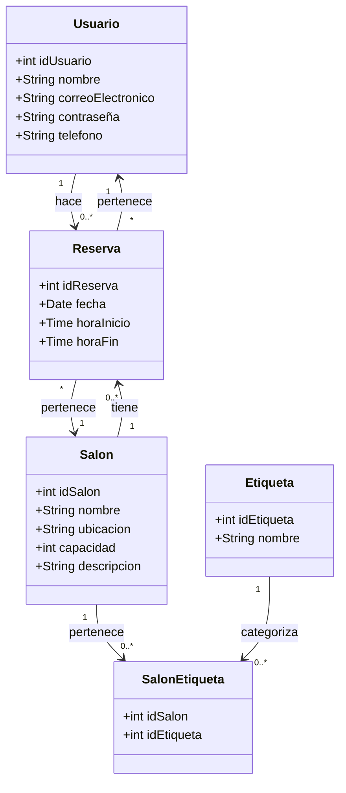

# Hackaton 1 - CS2031 Desarrollo Basado en Plataformas Ciclo 2024-1 📅✨

## Calificación 

La evaluación se realizará mostrando el funcionamiento de los endpoints en vivo a uno de los miembros del jurado. Deberán crear sus endpoints en Postman para testear la funcionalidad. Solo si se demuestra la funcionalidad completa de todo el sistema se otorgará el puntaje completo.

## Descripción del Caso

El objetivo de este proyecto es desarrollar un sistema de reservas que permita a los usuarios registrarse, iniciar sesión y realizar reservas en diferentes salones disponibles. Este sistema gestionará las siguientes entidades:

- *Usuario* 🧑‍💻
- *Salón* 🏢
- *Reserva* 📅
- *Etiqueta* 🏷

Además, se incluirá la funcionalidad de autenticación (registro e inicio de sesión) y una entidad adicional para manejar una relación de muchos a muchos.

## Requisitos del Sistema

1. *Autenticación y Gestión de Usuarios:*
   - Registro de usuarios.
   - Inicio de sesión de usuarios.

2. *Gestión de Salones:*
   - Información sobre los salones disponibles para reservas.

3. *Gestión de Reservas:*
   - Permitir a los usuarios realizar reservas en los salones para rangos de tiempo específicos.

4. *Relación Muchos a Muchos:*
   - Implementación de una entidad adicional para manejar una relación de muchos a muchos.

## Checkpoints 🛑

Habrá cuatro checkpoints definidos en base al progreso del proyecto:

1. **Checkpoint 1**: Implementación de todas las entidades.
2. **Checkpoint 2**: Desarrollo del sistema de autenticación.
3. **Checkpoint 3**: Implementación de los CRUDs para las entidades.
4. **Checkpoint 4**: Implementación de eventos y funcionalidades asíncronas.

## Diagrama de Clases con Mermaid 📚

## Funcionalidades 🌟

1. *Autenticación:*
   - *Registro*: Endpoint para que los usuarios se registren proporcionando nombre, correo electrónico, contraseña y teléfono.
   - *Inicio de sesión*: Endpoint para que los usuarios se autentiquen utilizando su correo electrónico y contraseña.

2. *Gestión de Salones:*
   - *CRUD*: Endpoints para crear, leer, actualizar y eliminar información de los salones.

3. *Gestión de Reservas:*
   - *Realizar Reserva*: Endpoint para que los usuarios reserven un salón especificando fecha y hora.

4. *Relación Muchos a Muchos:*
   - *Etiquetado de Salones*: Endpoints para asociar etiquetas a los salones y viceversa.

No se puede hacer una reserva si ese horario ya está ocupado.

## Endpoints 🚀

- *Registro de Usuario:*
  - POST /usuarios/register
- *Inicio de Sesión:*
  - POST /usuarios/login
- *Gestión de Salones:*
  - GET /salones
  - POST /salones
  - PUT /salones/{id}
  - DELETE /salones/{id}
- *Gestión de Reservas:*
  - GET /reservas
  - POST /reservas
  - PUT /reservas/{id}
  - DELETE /reservas/{id}
- *Gestión de Etiquetas:*
  - GET /etiquetas
  - POST /etiquetas
  - PUT /etiquetas/{id}
  - DELETE /etiquetas/{id}
- *Asociación de Salones y Etiquetas:*
  - POST /salones/{idSalon}/etiquetas/{idEtiqueta}
  - DELETE /salones/{idSalon}/etiquetas/{idEtiqueta}

## Eventos y Asincronía 🎉

Cada vez que un usuario realiza una reserva, se enviará un correo electrónico de confirmación al usuario. Para ello, se implementará un servicio de envío de correos electrónicos que se ejecute de forma asíncrona. Este servicio se encargará de enviar el correo electrónico de confirmación al usuario.

Además del envío de correos electrónicos, se implementará un evento asíncrono más avanzado: la generación de un reporte de reservas cada tres minutos. Este reporte contendrá un resumen de todas las reservas realizadas durante esos tres minutos y se enviará automáticamente a los administradores del sistema. Este proceso incluirá:

- Recolección de datos de reservas cada tres minutos.
- Generación del reporte en formato PDF.
- Envío del reporte por correo electrónico a los administradores.

Para lograr esto, se programará una tarea asíncrona que se ejecute cada tres minutos y realice las acciones descritas anteriormente.
